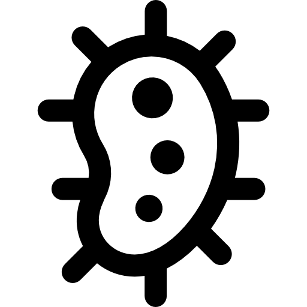

     BIA

## Sobre a BIA

Bia é uma tentativa de simular a vida (bio = vida) num ambiente computacional, especificando características e comportamentos do indivíduo "bio" num mundo controlado.

## Linguagem

Bia está sendo programado em Python, e poderá ter APIs para uso online e/ou educacional